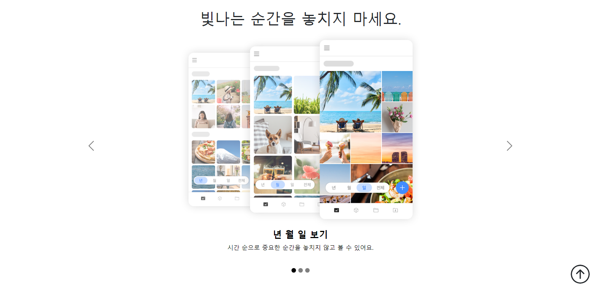

# Dreamofheaven.github.io
🥨깃헙 배포

# 1. Airbnb 클론코딩 (페어 프로그래밍) 
[🚀서비스 바로가기](https://dreamofheaven.github.io/01.%20airbnb_clone/main.html)
### 기술 스택
<ul>
  <li>HTML</li>
  <li>CSS</li>
  <li>bootstrap</li>
  <li>반응형웹</li>
</ul>

### 미리보기

# 2. 로또 번호 생성기 (페어 프로그래밍 + 개인적으로 프로젝트 빌드업)
[🚀서비스 바로가기]()
<ul>
  <li>HTML</li>
  <li>CSS</li>
  <li>bootstrap</li>
  <li>반응형웹</li>
  <li>javascript</li>
</ul>

# 3. 네이버 MY BOX 클론코딩 (페어 프로그래밍)
[🚀서비스 바로 가기](https://dreamofheaven.github.io/03.%20mybox/main.html)
### 기술 스택
<ul>
  <li>HTML</li>
  <li>CSS</li>
  <li>bootstrap</li>
  <li>반응형웹</li>
</ul>

### 미리보기

